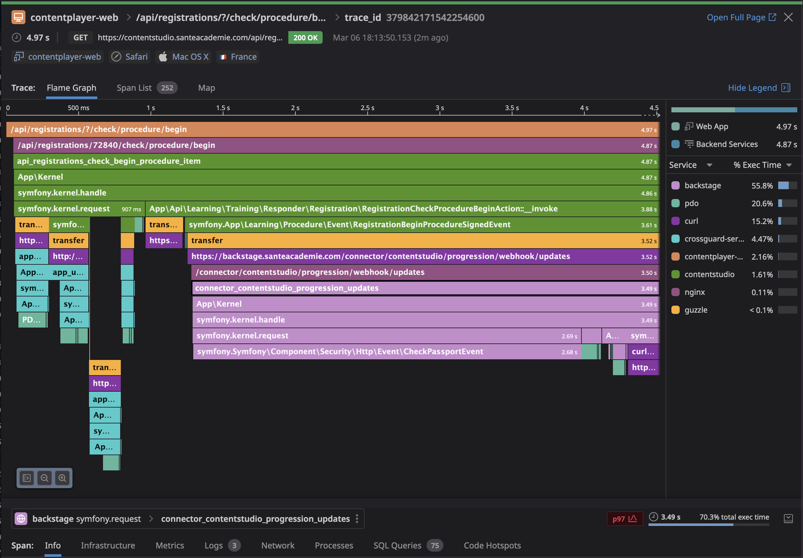

<!-- _class: dark top -->

# Datadog

---
# Fonctionnalités clés
- Alerting
- APM (Application Performance Monitoring - Tracing distribué, Tracking de versions, etc)
- Dashboard
- Gestion des incidents
- Logs
- Watchdog (Détecte les anomalies automatiquement)
---
<!-- _class: top teal -->
# Pourquoi Datadog ?
- Gain de temps (Facilité d'installation/maintenance)
- Beaucoup d'intégrations
- Outil Complet
---
# Avantages pour les développeurs
- Permet d'avoir une visibilité sur les services et l'infrastructure
- Une interface "simple" (*plus simple que de retenir un tas de commandes*)
- Repérer et résoudre les bugs et problèmes de performances plus facilement
---
# Tracing distribué

<!--
https://app.datadoghq.eu/apm/trace/379842171542254600 
Le Tracing distribué permet de voir le chemin d'une requêtes à travers différents services/applications
Utile pour comprendre d'ou vient le problème quand différents services sont impactés
-->

---
<!-- _class: top amber -->
# Démos
<!-- 
Voir les routes avec le plus de latence d'un service
Retrouver une trace depuis une requête (header x-datadog-trace-id)
Voir les logs d'une application
Corrélation logs/traces
Case managment
-->
---
<!-- _class: invert flat teal center -->
<!-- _footer: '' -->

**FIN**