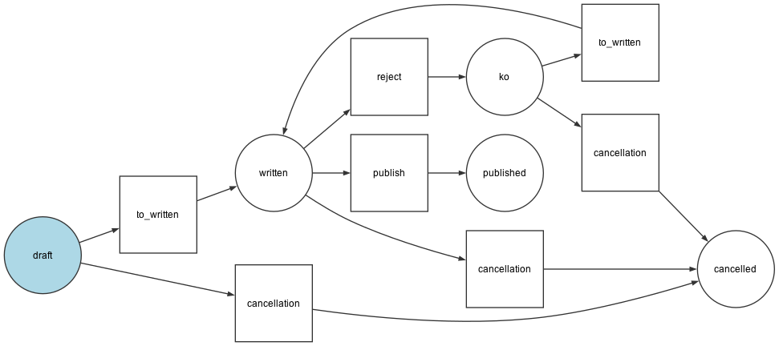

# Symfony Workflow

##### Documentation

https://symfony.com/doc/current/workflow.html

---

## State Machine

    A state machine is a subset of a workflow and its purpose is to hold a state of your model.

---

## Places & Transition


---

## Example

Writing, reviewing, publishing a book

---

```yaml
framework:
    workflows:
        book_publishing:
            type: 'state_machine'
            audit_trail:
                enabled: true
            marking_store:
                property: 'status'
            supports:
                - App\Entity\Book
            initial_marking: draft
            places:
                - draft
                - written
                - ko
                - published
                - cancelled
            transitions:
                to_written:
                    from: [draft, ko]
                    to:   written
                reject:
                    from: written
                    to:   ko
                publish:
                    from: written
                    to:   published
                cancellation:
                    from: [draft, written, ko]
                    to:   cancelled
```
---

`bin/console workflow:dump book_publishing | dot -Tpng -o graph.png`



---

## Events

`workflow.[workflow_name].[event_name].[place_name]`

 - __guard__
 - leave
 - transition
 - enter
 - entered
 - __completed__
 - announce

---

### Guard

 `TransitionBlocker`

### Completed

Manipulation

---

## Usage

```php
    public function can(object $subject, string $transitionName): bool;

    public function buildTransitionBlockerList(object $subject, string $transitionName): TransitionBlockerList;

    public function apply(object $subject, string $transitionName, array $context = []): Marking;
```

#### Association

`symfony/validator`, `symfony/voter`, `...`

---

## Questions ?